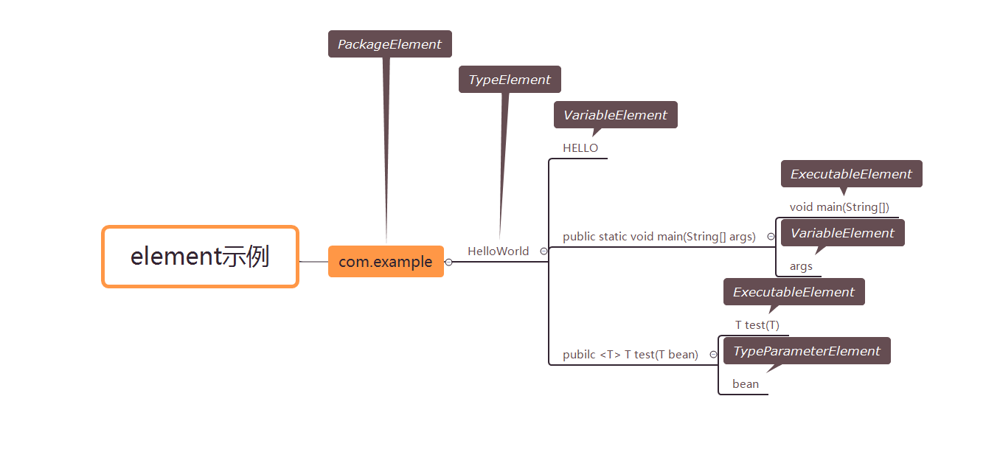
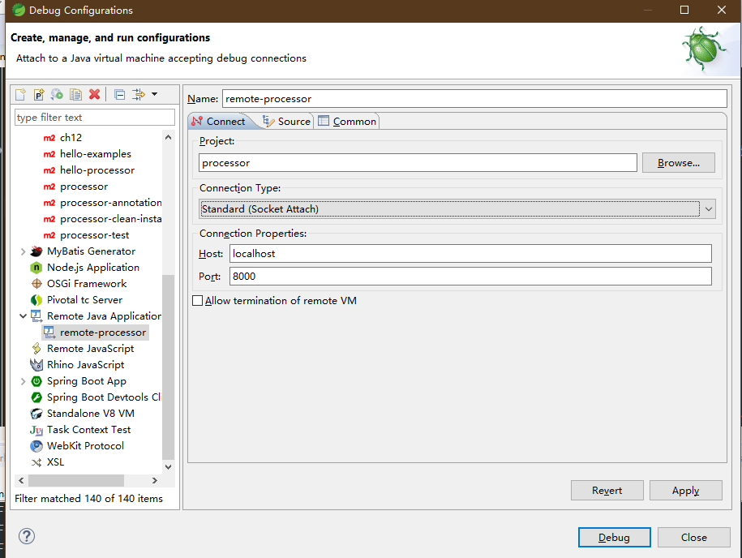
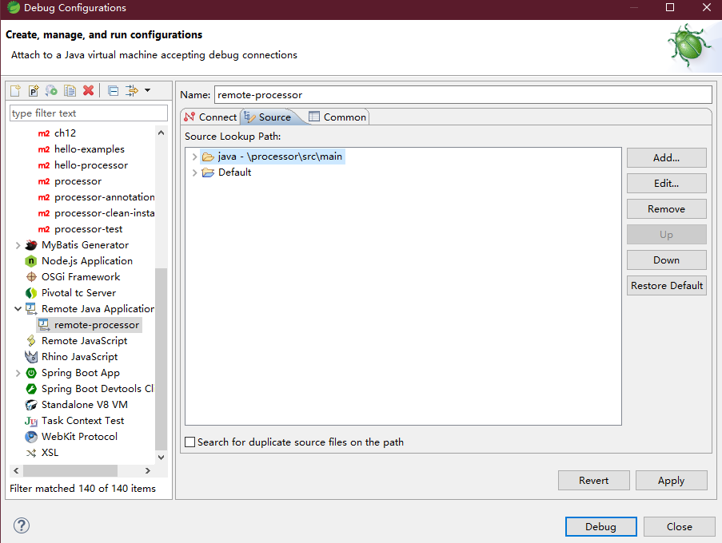
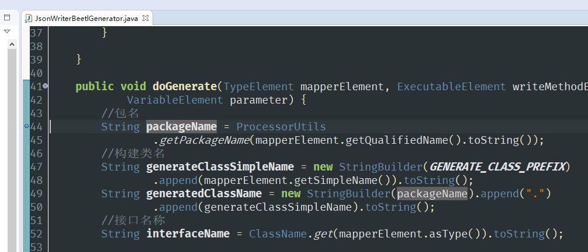
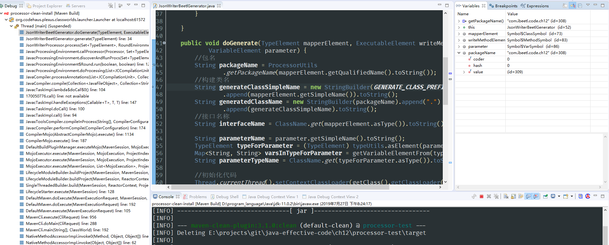
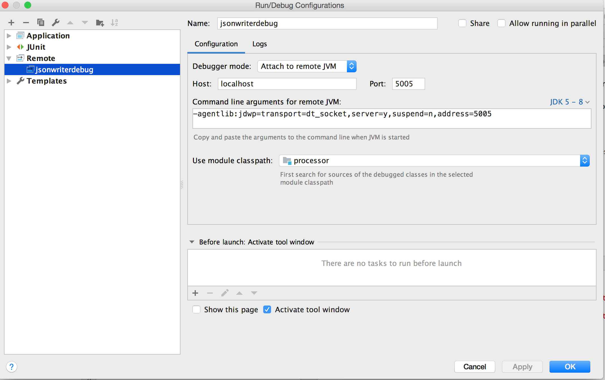

# 第十一章 JSR269编译时增强

**注意，这一章由于篇幅原因，并没有出现在印刷版本里**

jsr269（Pluggable Annotation Processing API），插入式注解处理接口，Java6开始支持，它的主要功能是在Java编译时对源码进行处理。我们熟悉的lombok，本书介绍的JMH，selma对象映射&拷贝工具等都属于JSR269的应用。业务系统也可以定义自己的JSR269注解，实现代码生成，源码修改来增强Java系统功能。

## 11.1 Java编译的过程

一般情况下我们使用jdk自带的工具javac将源码编译为class。javac的作用就是读取源码并将其编译为class文件。将源码编译class文件的过程一般要经历三个大步骤：

*上图的地址是：http://openjdk.java.net/groups/compiler/doc/compilation-overview/index.html*

1. 解析与填充符号表
	1. 将源代码的字符流转换为标记(Token)集合
	2. 将Token流构建为抽象语法树AST
	3.  将类的定义放到符号表中（Symbol Table）x
2. 调用合适的注解处理器 注解处理器完成后会重新跳转到步骤1，然后继续执行，直到没有合适的注解处理器
3. 分析然后生成class文件
	1.  标注检查 为AST添加属性。这一步包含名字解析(name resolution)，类型检测(type checking)和常数折叠(constant fold)
	2.  数据及控制流分析 为前面得到的AST执行流分析（Flow analysis）操作。这个步骤包含赋值(assignment)的检查和可执行性(reachability)的检查
	3.  处理语法糖 重写AST， 并且把一些复杂的语法转化成一般的语法，比如foreach、自动装箱拆箱、泛型等等
	4.  生成class文件,class文件包含字节码。

## 11.2 注解处理器入门
在Javac编译过程中，可以有我们参与的步骤只有注解处理器，通过注解处理器Api我们的代码有了参与编译过程的能力。
接下来我们将通过一个例子来进行处理;首先顶一个注解SayHello

```
package com.example;
public @interface SayHello {}
```
如下是此注解的注解处理器SayHelloProcessor

```java
package com.example;
import java.util.Set;
import javax.annotation.processing.AbstractProcessor;
import javax.annotation.processing.ProcessingEnvironment;
import javax.annotation.processing.RoundEnvironment;
import javax.annotation.processing.SupportedAnnotationTypes;
import javax.annotation.processing.SupportedSourceVersion;
import javax.lang.model.SourceVersion;
import javax.lang.model.element.TypeElement;
import javax.tools.Diagnostic;

@SupportedAnnotationTypes("com.example.SayHello")
@SupportedSourceVersion(SourceVersion.RELEASE_6)
public class SayHelloProcessor extends AbstractProcessor {

  @Override
  public synchronized void init(ProcessingEnvironment processingEnv) {
    super.init(processingEnv);
  }

  @Override
  public boolean process(Set<? extends TypeElement> annotations, RoundEnvironment roundEnv){
    if (!roundEnv.processingOver()) {
      //简单向控制台输出消息
      processingEnv.getMessager().printMessage(Diagnostic.Kind.NOTE, "Hello World!");
    }
    return true;
  }
}

```
**第一步**

1. 创建一个注解`@SayHello`
2. 创建一个处理类`SayHelloProcessor`，继承自`javax.annotation.processing.AbstractProcessor`:
	1. 实现process方法，简单输出"Hello World!"
	2. `@SupportedAnnotationTypes` 该注解用来表示处理器支持的注解名称,需要使用全名
	3. `@SupportedSourceVersion` 注解支持的源码编译版本，我们这里支持JDK6以上

**第二步**，创建两个测试类，一个用`@SayHello`注解标记，一个不用

```java
public class WithOutSayHello {}
```
```java
@SayHello
public class WithSayHello {}
```

**第三步**，注册注解处理器

为了使得注解处理能被识别，需要使用SPI，Java获取注册服务的一种机制，JDBC加载不同类型数据库的驱动SF4J加载不同提供商的日志实现类等，注解处理器也可以通过这种方式使用：在META-INF/services目录中新建“javax.annotation.process.Processors“文件，在 “javax.annotation.process.Processors“ 文件写入注解处理器的全称

~~~
com.example.SayHelloProcessor
~~~

如果有多个处理器，每行放一个。处理器执行的顺序就是文件中的顺序

如下是JMH注册的注解处理器，位于jmh-genenrator-annprocess.jar/META-INF/services/javax.annotation.process.Processors

~~~java
org.openjdk.jmh.generators.BenchmarkProcessor
~~~

**第四步** ，编译整个工程或者编译WithSayHello类，都能看到注解处理器被执行，IDE控制台有如下输出

~~~
Information:java: Hello World!
~~~


## 11.3 相关概念介绍

首先我们会简单介绍一下用到的组件

### 11.3.1 AbstractProcessor
之前也用过AbstractProcessor，在此小结将对其方法进行简单的介绍，AbstractProcessor继承自接口Processor，其中有几个方法有尤其重要:
1. `void init(ProcessingEnvironment env)` 该方法的主要作用是初始化注解处理器，并提供一系列工具给注解处理器，比如
	1.  Elements 与Element相关的工具
	2.  Types 与TypeMirror相关的工具
	3.  Filer 创建源文件或类文件等的工具
	4.  Messager 用于报告错误、警告等信息的工具
2.  `boolean process(Set<? extends TypeElement> annotations,RoundEnvironment roundEnv)` 注解处理器函数，处理前一轮元素上的一组注释类型，并返回此处理器是否声明这些注释类型。
	1.  annotations 处理的注解集合
	2.  roundEnv 包含当前以及前一轮的环境，可以获得语法树上的所有元素，以及包含特定注解的元素
	3.  返回值 此处理器是否声明这些注释类型
		1. true 该类型的注解是在本处理器处理的范围，并且不需要后续的注解处理器处理
		2. false 该注解不是本处理器处理的访问，需要后续的处理器处理
		3. 同一处理器，可能总是返回相同的布尔值，或者根据自己选择的条件改变结果
3. `Set<String> getSupportedAnnotationTypes)` 获取当前注解处理器支持的注解类型，在AbstractProcessor中其默认实现是获取注解处理上的注解`SupportedAnnotationTypes`
4. `SourceVersion getSupportedSourceVersion()`  获取当前注解处理器支持的源码版本，在AbstractProcessor中其默认实现是获取注解处理上的注解`SupportedSourceVersion`

>ps: 设置支持的注解，需要注意到是，如果支持的设置的是`*`，那么process方法最好返回false，否则该注解处理器之后的所有注解处理器都不再起作用。

>ps: 通过`SupportedSourceVersion`配置支持的源码版本，只能存储固定的值，如果确保当前处理器可以支持后续的版本，则可以在处理器中覆盖getSupportedSourceVersion方法
>```
> @Override
    public SourceVersion getSupportedSourceVersion() {
        return SourceVersion.latest();
    }
>```


### 11.3.2 Element与TypeMirror
之前的入门章节中，因为只是简单的打印日志，所以没有深入的讲解注解处理器的相关概念，但是在进阶篇中需要对一些概念进行介绍
- Element 表示程序元素，如模块、包、类、方法、变量、参数等
| 元素名称 |    描述 |
| :-------- | --------|
|ExecutableElement| 可执行元素，表示方法、构造函数、类或接口的初始化方法（静态或非静态）以及注解元素 |
|PackageElement| 包元素，表示java接口 |
|TypeElement| 类元素，表示类或接口 |
|TypeParameterElement| 泛型参数元素，表示泛型类、接口、方法或构造函数元素的形式类型参数。 |
|VariableElement | 字段元素，一个字段、enum 常量、方法或构造方法参数、局部变量或异常参数 |

可能这么讲还不是很直观，以如下例子为例：
```java
pacakge com.example;
public class HelloWorld {
    public static final String HELLO = "Hello World!";

    public static void main(String[] args) {
        System.out.println(HELLO);
    }

    public <T> T test(T bean){
       //具体方法
        return bean;
    }
}
```
1. 对于上述类，有一个PackageElement表示`com.example`
	2. 其有一个子元素TypeElement表示`com.example.HelloWorld`
		1. VariableElement 表示HELLO
		2. ExecutableElement 表示`void main(String[])`的方法
			1. VariableElement  表示方法的参数`String[] args`
		3. ExecutableElement 表示`T test(T)` 方法
			1. TypeParameterElement 表示类型参数bean



- TypeMirror 表示的Java语言中的类型，比如原生类型、类、接口、注解等
| 类型名称 |    描述 |
| :-------- | --------|
|ExecutableType| 可执行类型，表示方法、构造函数、类或接口的初始化方法（静态或非静态） |
|IntersectionType| 交叉类型，比如`<T extends Number & Runnable>`表示的类型 |
|NoType| 一个伪类型，在没有实际类型的情况下使用|
|PrimitiveType| 原生类型，boolean, byte, short, int, long, char, float, and double.|
|ReferenceType| 引用类型，包括class和interface（DeclareType）、数组类型(ArrayType)、空类型（NullType）、类型参数（TypeVariable） |
|UnionType| 联合类型，比如mult-catch 异常 |
|WildcardType| 通配符类型参数，比如`?`、`? extends Number`等 |
Element与TypeMirror是描述同一个内容的不同方向，从ElementKind与TypeKind两个枚举中看到这些：
元素的种类：

```
public enum ElementKind {

    /** A package. */
    PACKAGE,

    // Declared types
    /** An enum type. */
    ENUM,
    /** A class not described by a more specific kind (like {@code ENUM}). */
    CLASS,
    /** An annotation type. */
    ANNOTATION_TYPE,
    /**
     * An interface not described by a more specific kind (like
     * {@code ANNOTATION_TYPE}).
     */
    INTERFACE,

    // Variables
    /** An enum constant. */
    ENUM_CONSTANT,
    /**
     * A field not described by a more specific kind (like
     * {@code ENUM_CONSTANT}).
     */
    FIELD,
    /** A parameter of a method or constructor. */
    PARAMETER,
    /** A local variable. */
    LOCAL_VARIABLE,
    /** A parameter of an exception handler. */
    EXCEPTION_PARAMETER,

    // Executables
    /** A method. */
    METHOD,
    /** A constructor. */
    CONSTRUCTOR,
    /** A static initializer. */
    STATIC_INIT,
    /** An instance initializer. */
    INSTANCE_INIT,

    /** A type parameter. */
    TYPE_PARAMETER,

    /**
     * An implementation-reserved element.  This is not the element
     * you are looking for.
     */
    OTHER,

    /**
     * A resource variable.
     * @since 1.7
     */
     RESOURCE_VARIABLE,

    /**
     * A module.
     * @since 9
     * @spec JPMS
     */
     MODULE;
     ....
 }
```
类型的种类：
```java
public enum TypeKind {
    /**
     * The primitive type {@code boolean}.
     */
    BOOLEAN,

    /**
     * The primitive type {@code byte}.
     */
    BYTE,

    /**
     * The primitive type {@code short}.
     */
    SHORT,

    /**
     * The primitive type {@code int}.
     */
    INT,

    /**
     * The primitive type {@code long}.
     */
    LONG,

    /**
     * The primitive type {@code char}.
     */
    CHAR,

    /**
     * The primitive type {@code float}.
     */
    FLOAT,

    /**
     * The primitive type {@code double}.
     */
    DOUBLE,

    /**
     * The pseudo-type corresponding to the keyword {@code void}.
     * @see NoType
     */
    VOID,

    /**
     * A pseudo-type used where no actual type is appropriate.
     * @see NoType
     */
    NONE,

    /**
     * The null type.
     */
    NULL,

    /**
     * An array type.
     */
    ARRAY,

    /**
     * A class or interface type.
     */
    DECLARED,

    /**
     * A class or interface type that could not be resolved.
     */
    ERROR,

    /**
     * A type variable.
     */
    TYPEVAR,

    /**
     * A wildcard type argument.
     */
    WILDCARD,

    /**
     * A pseudo-type corresponding to a package element.
     * @see NoType
     */
    PACKAGE,

    /**
     * A method, constructor, or initializer.
     */
    EXECUTABLE,

    /**
     * An implementation-reserved type.
     * This is not the type you are looking for.
     */
    OTHER,

    /**
      * A union type.
      *
      * @since 1.7
      */
    UNION,

    /**
      * An intersection type.
      *
      * @since 1.8
      */
    INTERSECTION,

    /**
     * A pseudo-type corresponding to a module element.
     * @see NoType
     * @since 9
     * @spec JPMS
     */
    MODULE;
    ...
 }
```
举个例子，比如对于`public static final String HELLO = "Hello World!"`，则有一个VariableElement表示HELLO其Kind是`Field`，该VariableElement的TypeMirror表示的是`java.lang.String`其Kind是`DECLARED`。


## 11.4 注解处理器进阶
如果我们只是用来输出“Hello World!”，那么就小看了注解处理器的功能。当我们可以在编译阶段操作源码时，我们就可以使用通过使用注解生成额外的功能，比如非常流行的lombok、selma映射工具以及​ ButterKnife（Android中的View注入框架,）这些都是非常优秀的工具，它们都采用Jsr269。
那么我们也来完成一个功能，它的主要功能是生成辅助类，用于将Java对象转换为Json字符串，当然已经有很多开源软件比如Jackson，Fastjson等，但是我们要做的与它们不同，我们直接通过做字符串拼接来实现，举个例子：

```java
public class User {
	private String name;
	private String address;
	// 省略Getter和Setter
}

@JsonWriter
public interface UserJsonMapper {
    public String write(User user);
}

//生成的类
public class Jsr269_UserJsonMapper implements UserJsonMapper {
	@Override
	public String write(User user) {
		StringBuilder sb = new StringBuilder();
		sb.append(JsonWriterConstants.OBJECT_PREFIX);
		sb.append("\"name\":");
		sb.append(user.getName());
		sb.append(",");
		sb.append("\"address\":");
		sb.append(user.getAddress());
		sb.append(JsonWriterConstants.OBJECT_SUFFIX);
		return sb.toString();
	}
}
```
对于User对象，只要定义了一个接口，则我们通过注解处理器，生成此接口的实现，类似与Jsr269_UserJsonMapper的实现类，这样当我们需要将User对象转换为Json字符串时，调用此实现类，就会非常高效转化Json串。
### 11.4.1 JsonWriter注解
我们构建一个注解JsonWriter，用于表示以此注解标注的接口，会生成其子类用于实现Java Bean到Json String的转换
```java
@Target(ElementType.TYPE)
@Retention(RetentionPolicy.SOURCE)
public @interface JsonWriter {
}
```
有了此注解后，上一节的UserJsonMapper接口就会生成Jsr269_UserJsonMapper实现，从而完成对象到JSON的序列化

### 11.4.2 处理器与生成辅助类

接下来我们开始编写注解处理器，注解处理器中的代码非常简单
1. 声明对JsonWriter注解的处理
2. 调用JsonWriterGenerator类来生成对应的方法
```java
@SupportedAnnotationTypes("com.ibeetl.code.ch11.processor.annotation.JsonWriter")
public class JsonWriterProcessor extends AbstractProcessor {

  private JsonWriterGenerator jsonWriterGenerator;

  @Override
  public synchronized void init(ProcessingEnvironment processingEnv) {
    super.init(processingEnv);
    jsonWriterGenerator = new JsonWriterGenerator(processingEnv);
  }

  @Override
  public boolean process(Set<? extends TypeElement> annotations,
                         RoundEnvironment roundEnv) {
    for (TypeElement annotation : annotations) {
      Set<? extends Element> elements = roundEnv.getElementsAnnotatedWith(annotation);
			//处理每一个@JsonWriter标注的接口
      for (Element ele : elements) {
        //用模板技术生成java代码
        jsonWriterGenerator.generate((TypeElement) ele);
      }
    }
    return true;
  }

}
```
重点就是生成辅助类，在生成辅助类中我们需要做的有以下几件事
1. 检查JsonWriter标记的接口中是否有一个方法，且该方法返回类型为java.lang.String，其入参只有一个
2. 从该方法的入参中获取其类型，找的其对应的getter方法，并以此构建Map对象
3. 使用构建好的Map对象构建相应的调用语句
4. 生成以固定名称开头的实现类，比如Jsr269_
~~~java
@Override
public void generate(TypeElement mapperElement) {
  //检测接口是否只有一个方法
  if (checkValid(mapperElement)) {
    //获得此方法
    ExecutableElement writeMethodElement = (ExecutableElement) mapperElement
      .getEnclosedElements().get(0);
    //检测此方法是否符合要求
    if (checkValidWrite(writeMethodElement)) {
      VariableElement parameter = writeMethodElement.getParameters().get(0);
      //生成序列化代码，假定第一个参数为目标对象，如User
      doGenerate(mapperElement, writeMethodElement, parameter);
    }
  }
}
~~~

doGenerate负责生成Java代码，AbstractJsonWriterGenerator有俩个子类，一个是用Beetl，采用模板生成，一个是采用javapoet工具生成Java代码。由于篇幅限制，本节采用Beetl模板生成。

> javapoet是一款生成Java代码的辅助工具，也是注解处理器常用的代码生成工具。本书配套例子也提供javapoet

```java
public class JsonWriterBeetlGenerator extends AbstractJsonWriterGenerator {
  ...
    public void doGenerate(TypeElement mapperElement, ExecutableElement writeMethodElement,
                           VariableElement parameter) {
    //包名
    String packageName = ProcessorUtils
      .getPackageName(mapperElement.getQualifiedName().toString());
    //构建类名，以“Jsr269_”为前缀
    String generateClassSimpleName = new StringBuilder(GENERATE_CLASS_PREFIX)
      .append(mapperElement.getSimpleName()).toString();
    String generatedClassName = new StringBuilder(packageName).append(".")
      .append(generateClassSimpleName).toString();
    //接口名称
    String interfaceName = ClassName.get(mapperElement.asType()).toString();

    String parameterName = parameter.getSimpleName().toString();
    TypeElement typeForParameter = (TypeElement) typeUtils.asElement(parameter.asType());
    //得到对象的javabean名称和对应的getter方法，比如返回{"name":"getName"},方便代码生成
    Map<String, String> varsInTypeForParameter = getVariableElementFrom(typeForParameter);
    String parameterTypeName = ClassName.get(typeForParameter.asType()).toString();
		//模板生成代码，见下一个代码片段
  }
```
通过上诉代码片段，我们可以得出基本信息

* generatedClassName，生成的目标类，在本例中是Jsr269_UserJsonMapper
* interfaceName，接口，即UserJsonMapper
* parameterName，参数名字
* typeForParameter ，TypeElement类型，即User对象
* varsInTypeForParameter，一个Map结构，调用getVariableElementFrom获取User对象的属性

* parameterTypeName ，本例为"User"

有了如上信息，就可以生成代码，我们代码模板如下，类似在本节Jsr269_UserJsonMapper.java，

~~~java
package ${packageName};

import com.ibeetl.code.ch12.processor.annotation.JsonWriterConstants;
import com.ibeetl.code.ch12.processor.annotation.JsonWriterUtils;
import java.lang.String;
import java.lang.StringBuilder;
import ${parameterTypeQualifiedName};

public class ${generateClassSimpleName} implements ${interfaceName} {
  public String ${writeMethodName}(${parameterTypeName} ${parameterName}) {
    StringBuilder sb = new StringBuilder();
    sb.append(JsonWriterConstants.OBJECT_PREFIX);
	  @ for(entry in varsInTypeForParameter!){
	  sb.append("\"${entry.key}\"").append(':');
	  sb.append('"').append(${parameterName}.${entry.value}()).append('"');
	    @if(!entryLP.last ){
	  sb.append(',');
		  @ }
	  @ }
    sb.append(JsonWriterConstants.OBJECT_SUFFIX);
    return sb.toString();
  }
}
~~~

生成代码使用Beetl技术，关于Beetl模板引擎，可以参考本书第五章高性能工具

~~~java
//开始模板生成代码
Thread.currentThread().setContextClassLoader(getClass().getClassLoader());
GroupTemplate gt = new GroupTemplate();
gt.getConf().setStatementStart("@");
gt.getConf().setStatementEnd(null);
gt.getConf().build();
//获取模板
Template t = gt.getTemplate("mapper.btl");
//设定模板参数
t.binding("packageName", packageName);
t.binding("interfaceName", interfaceName);
t.binding("generateClassSimpleName", generateClassSimpleName);
t.binding("writeMethodName", writeMethodElement.getSimpleName().toString());
t.binding("parameterTypeQualifiedName", typeForParameter.getQualifiedName().toString());
t.binding("parameterTypeName", parameterTypeName);
t.binding("parameterName", parameterName);
t.binding("varsInTypeForParameter", varsInTypeForParameter);
//渲染结果，得到类似Jsr269_UserJsonMapper的Java源码
String str = t.render();
OutputStream fout = null;
try {
  //保存源码到工程
  JavaFileObject builderFile = processingEnv.getFiler()
    .createSourceFile(generatedClassName);
  fout = builderFile.openOutputStream();
  fout.write(str.getBytes(StandardCharsets.UTF_8));
} catch (IOException e) {
  messager.printMessage(Kind.ERROR, "写入文件错误！");
} finally {
  ......
}

~~~

当我们保存UserJsonMapper接口（或者重新build整个工程的时候），就能在UserJsonMapper同包下生成一个期望的Jsr269_UserJsonMapper类。


### 11.4.3 使用生成的Mapper类

为了使用我们生成的类，需要动态加载， 因为生成的类都是以`Jsr269_`开头，所以我们可以通过ClassLoader动态加载生成的类并缓存起来
```java
public class MapperTools {
  private static final String CLASS_PREFIX = "Jsr269_";
  /** Key为定义的接口，value为生成的接口实现示例*/
  private static Map<Class<?>, Object> mappers = new HashMap<>();

  @SuppressWarnings("unchecked")
  public static synchronized <T> T getMapper(Class<T> mapperClass) {
    if (mappers.containsKey(mapperClass)) {
      return (T) mappers.get(mapperClass);
    }
    String generatedClassName =
      new StringBuilder(mapperClass.getPackage().getName()).append(".")
      .append(CLASS_PREFIX).append(mapperClass.getSimpleName()).toString();
    try {
      Class<?> clazz = mapperClass.getClassLoader().loadClass(generatedClassName);
      Object obj = clazz.getDeclaredConstructor().newInstance();
      //放入缓存
      mappers.put(mapperClass, obj);
      return (T) obj;
    } catch (Exception e) {
      throw new RuntimeException("获取辅助类错误",e);
    }
  }
}
```

有了MapperTools，我们可以通过接口获取其实现，比如
```java
UserJsonMapper jsonMapper = MapperTools.getMapper(UserJsonMapper.class);
String str = jsonMapper.write(user);
```

在第5章介绍过Jackson时一款高性能的JSON工具，可以测试一下通过Jsr269生成的Json序列化类的速度，我们使用JMH测试

```java
@BenchmarkMode(Mode.AverageTime)
public class JMHJsonTest {
	ObjectMapper jacksonMapper = new ObjectMapper();
	UserJsonMapper jsonMapper = MapperTools.getMapper(UserJsonMapper.class);
	User user = new User("张三", "大厅123");
	@Benchmark
	public String jsr269(){
		String value =  jsonMapper.write(user);
		return value;
	}
	@Benchmark
	public String jackson() throws Exception{
		String value = jacksonMapper.writeValueAsString(user);
		return value;
	}
}
```
结果如下,可以看到我们做的Json工具比Jackson还快2.5倍

```
Benchmark                      Mode  Samples    Score  Score error  Units
c.i.c.c.JMHJsonTest.jackson    avgt        5  227.256       31.979  ns/op
c.i.c.c.JMHJsonTest.jsr269     avgt        5   89.472       13.133  ns/op
```

> 实现JSON序列化远比这个例子复杂，JsonWriter注解的实现仅是一个简单的示例，

### 11.4.4 注解处理器的使用
我们开发好的注解处理器怎么才能在构建的时候被调用呢，有以下几个步骤需要使用
#### 11.4.4.1 SPI配置
SPI是Java获取注册服务的一种机制，常用的方式有：JDBC（加载不同类型数据库的驱动）SF4J（加载不同提供商的日志实现类）等，注解处理器也可以通过这种方式使用：
1. 在META-INF/services目录中新建javax.annotation.process.Processors文件
2. 在 javax.annotation.process.Processors 文件写入注解处理器的全称，在本例中就是`com.ibeetl.code.ch12.processor.JsonWriterProcessor`
3. 多个处理器在不同的行展示
>ps:处理器执行的顺序就是文件中的顺序

#### 11.4.4.2 Maven插件
我们可以使用Maven（Gradle）插件来调用注解处理器，比如`maven-compiler-plugin`，因为注解处理器是jdk1.6之后新增的功能，所有要求jdk版本大于等于1.6
maven-compiler-plugin是一个比较常用的Maven插件，其主要作用是对源码进行编译，有很多配置项，与注解处理器有关的有两个：

| 配置项名称|    插件版本 | 作用  |
| :-------- | --------:| :--: |
| annotationProcessorPaths| 3.5及以后 |   用来指定编译器扫描注解处理器的路径，只会在特定的路径中扫描   |
| annotationProcessors| 2.5及以后 |  用来指定注解处理器，如果不指定，则就会使用默认的注解处理器发现模式（SPI）   |

```xml
<build>
	<plugins>
		<plugin>
			<artifactId>maven-compiler-plugin</artifactId>
			<configuration>
			  <annotationProcessorPaths>
			    <path>
			      <groupId>org.sample</groupId>
			      <artifactId>sample-annotation-processor</artifactId>
			      <version>1.2.3</version>
			    </path>
			    <!-- ... more ... -->
			  </annotationProcessorPaths>
			  <annotationProcessors>
				<annotationProcessor>ProcessorA</annotationProcessor>
				<annotationProcessor>ProcessorB</annotationProcessor>
			  </annotationProcessors>
			</configuration>
		</plugin>
	</plugins>
</build>
```
>ps:如果不设置`annotationProcessorPaths`或`annotationProcessors`,`maven-compiler-plugin`会自动在所有依赖中通过SPI的方式，扫描注解处理器(扫描javax.annotation.process.Processors文件)，然后按顺序调用注解处理器
> 当我们做注解处理器开发的时候，如果已经设置了javax.annotation.process.Processors，`maven-compiler-plugin`可能会自动查找并调用注解处理器，此时应该避免调用，可将配置修改为：
 ```xml
	<plugin>
		<artifactId>maven-compiler-plugin</artifactId>
		<configuration>
			<proc>none</proc><!-- 不调用注解处理器 -->
		</configuration>
	</plugin>
 ```

#### 11.4.4.2 Gradle插件
如果使用的是Gradle来构建项目，那么可以按照如下配置调用来使用注解处理器
```Gradle
configurations {
	apt
}
dependencies {
	// 注解处理器jar包，会自动处理依赖
	apt 'code.ibeetl.com.ch12:processor:0.1'
    //  相关的注解
	implementation 'code.ibeetl.com.ch12:processor-annotations:0.1'
}
compileJava {
	options.annotationProcessorPath = configurations.apt
}
```

## 11.5 调试注解处理器

当开发注解处理器时，因为很多类都是在编译阶段才能获取到，我们不可能等所有代码开发结束才实际调用测试，我们不能保证开发的代码没有错误，那么调试是一个比较好的解决方式。当编译源码的时候，jdk是启动了一个新的虚拟机来编译你的源码，那么在这种情况下，我们就可以使用remote debugging的方式来进行调试。关于远程调试的相关概念可以去参考资料深入阅读。

### 11.5.1 Eclipse中调试注解处理器
首先设置调试，路径是`run->Debug Configurations`，找到remote java Application ，新建

1. 选择注解处理器所在的项目，在本例中是processor
2. 选择连接模式，默认Socket Attach
3. 选择主机与端口，应为在本地调试，所以选择localhost与8000


1. 设置源码搜索路径，本例中设置的是`processor\src\main\java`


1. 在代码中打上断点

以debug模式运行build，则会自动进入debug，此时我们就可以打断点，进行调试了



### 11.5.2 Idea中调试注解处理

首先Edit Configuration，添加 一个Remote。设置名称为jsonwriterdebug，设置端口为5005，在Use Module classpath选中注解处理所在工程




然后，修改IDEA的启动参数，使用快捷键 Ctrl+Shift+A，输入Edit Custom VM Options ，添加一行并重启IDEA。

~~~java
-Dcompiler.process.debug.port=5005
~~~

当在编译阶段，会远程链接到5005端口，这时候，运行配置好的jsonwriterdebug，代码就能停在指定的breakpoint，这样就可以开始调试。

